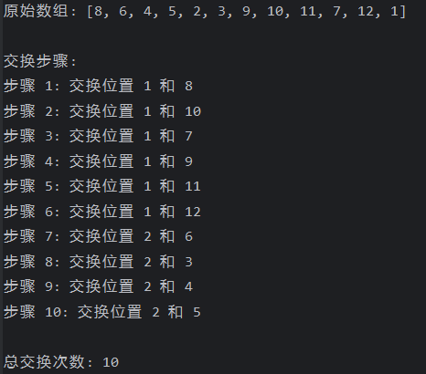
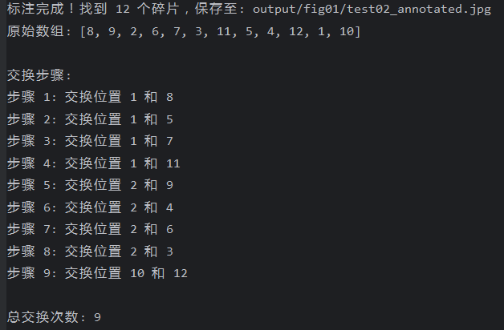

# figure_annotate_sort
三国杀时光绘卷拼图自动标注并给出交换步骤


**最后更新**: 2025-08-30 10:02:30

- ✅ 已完成: 第一幅图标注
- 🚧 进行中: 第二幅图标注 (预计今日完成)
- ⏳ 待更新: 第三幅图及后续

## 路径说明
1. reference_patches/fig0x/: 每幅拼图的切片路径，用于精准定位截图碎片位置，目前只有第一幅图，后续会更新。
2. screenshot/fig0x/: 放置未标注的截图，每幅图的截图需要放在相对应的子文件夹下，目前只有第一幅图。
3. output/fig0x/: 标注好的截图输出路径。

## 使用说明
有两种模式，一种是直接给出截图顺序，正确顺序编号为：
<table style="border: none; border-collapse: collapse;">
<tr>
<td align="center">1</td>
<td align="center">2</td>
<td align="center">3</td>
<td align="center">4</td>
</tr>
<tr>
<td align="center">5</td>
<td align="center">6</td>
<td align="center">7</td>
<td align="center">8</td>
</tr>
<tr>
<td align="center">9</td>
<td align="center">10</td>
<td align="center">11</td>
<td align="center">12</td>
</tr>
</table>

另一种是直接给出未排序好的截图，需要注意截图只能包含碎片的部分，如果不裁剪，程序识别率很低很难标注准确。  

截图示意:  

 
## 模式1： 直接给出碎片顺序
```python
figure_label = '01'  # 第一幅图参数
screenshot_figure_name = 'test02.jpg'  # 截图图像名
po = [7, 3, 8, 11, 12, 2, 4, 1, 10, 5, 9, 6]  # 直接赋值，不会自动给图像编号
running(figure_label, screenshot_figure_name, po)
```
结果如下：  


## 模式2：给出未标注的截图
```python
figure_label = '01'
screenshot_figure_name = 'test02.jpg'
po = None  # 自动给图像编号，并给出交换步骤
running(figure_label, screenshot_figure_name, po)
```
结果如下：  


## 联系方式
B站：ssss要加油哦
闲话：ssss要加油哦
QQ: 1903425766

